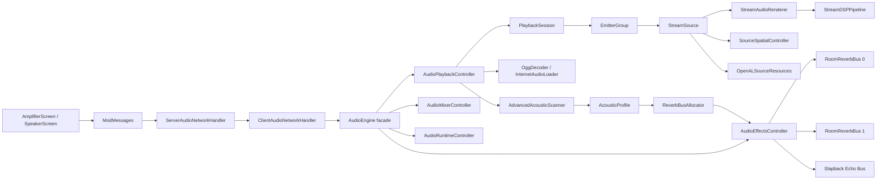

# ECHO Sound Engine Architecture Guide

Bu belge, projeye ilk kez giren bir gelistirme agentinin sistemi hizli ve dogru
anlamasi icin ana teknik kaynaktir. Siniflarin yalnizca ne yaptigini degil, hangi
sinirlarin neden korunmasi gerektigini ve bir degisiklikte nereden baslanacagini
da anlatir.

Urun adi `ECHO Sound Engine`, korunmasi gereken dahili mod/registry kimligi ise
`audiophilecraft`tir.

Son dogrulama: 2026-08-02, Minecraft 1.20.1, Fabric, Java 17.

> Onemli: `README.md` urun tanitimi icindir ve bazi teknik ayrintilari eski
> olabilir. Kod mimarisi icin bu belge ve gercek kaynak kod esas alinmalidir.

## 1. Hizli Ozet

ECHO Sound Engine, Minecraft'in standart ses oynaticisini kullanmak yerine kendi
OpenAL tabanli akisini kurar. Bir parca yerel OGG dosyasindan veya internetten
PCM'e cevrilir. Ayni PCM zaman cizelgesi, dunyadaki her fiziksel hoparlor icin
ayri bir OpenAL kaynagi tarafindan okunur. Her kaynak kendi konumunu,
yonlendiriciligini, uzaklik tepkisini, occlusion filtresini ve efekt sendlerini
tasir.

Sistemin ana modeli sudur:

```text
Bir kullanici/session
  -> bir PlaybackSession
     -> ortak PCM zaman cizelgesi ve mixer ayarlari
     -> birden fazla EmitterGroup (fiziksel hoparlor clusterlari)
        -> birden fazla StreamSource (her hoparlor icin OpenAL source)
           -> StreamAudioRenderer (PCM ve propagation)
           -> StreamDSPPipeline (crossover, EQ, harmonik)
           -> SourceSpatialController (mesafe, yon, occlusion, send)
           -> OpenALSourceResources (native OpenAL sahipligi)
```

Akustik tarafinda her `EmitterGroup` kendi mekanini tarar. Sinirsiz sayida
mantiksal mekan profili olabilir, fakat bunlar performans ve donanim uyumlulugu
icin iki fiziksel room-reverb bus uzerine sanallastirilir. Slapback echo ayri bir
fiziksel send kullanir.

## 2. Degismez Kurallar

Bu kurallar ihlal edilirse kod derlense bile ses bozulabilir, multiplayer
senkronu kayabilir veya OpenAL context coker.

1. Minecraft `World`, chunk ve block erisimi yalnizca istemci ana akisi
   uzerinde yapilir. Decoder pool veya ses thread'i dunyaya dokunmaz.
2. OpenAL source queue ve native lifecycle degisiklikleri `AudioEngine` yasam
   dongusu kilidiyle koordine edilir.
3. Bir session'in zamani `PlaybackSession` icindeki tek ortak saatten gelir.
   Her hoparlor bagimsiz bir sarki saati uretmez.
4. Fiziksel hoparlor konumu HRTF icin korunur. Cluster merkezi mekan taramasi ve
   propagation senkronunda kullanilabilir, fakat tum kaynaklar tek merkeze
   tasinmaz.
5. Heatmap, gercek reverb taramasinin `pointCloud` ve `venueBlocks` sonucunu
   gostermek zorundadir. Arayuz icin ayri bir sahte geometri uretilmez.
6. Reverb profili aktif wet sinyal varken aniden degistirilmez. Bus degisimi
   fade-out, profil degisimi ve fade-in sirasini korur.
7. URL callback'i session'i yalnizca kendi request ID'si hala gecerliyse
   degistirebilir. Eski decode callback'i yeni parcayi ezemez.
8. Yerel ve internet sesi dahili olarak interleaved stereo PCM tasir. Mono veri
   `[M, M]`, stereo veri `[L, R]` olur.
9. Source attenuation, direct occlusion ve wet send attenuation farkli
   sorumluluklardir. Ayni volume dususu iki yerde tekrar uygulanmaz.
10. Cihaz kaybindan sonra eski OpenAL ID'leri silinmeye calisilmaz. Java/native
    tamponlar serbest birakilir ve backend yeni context uzerinde tekrar kurulur.
11. `AudioEngine` public API/facade siniridir. Yeni DSP veya tarama algoritmasi
    dogrudan bu sinifa doldurulmaz.
12. Multiplayer paketleri PCM tasimaz. Her istemci parcayi kendi decode eder;
    sunucu yalnizca komut, metadata ve senkron bariyerlerini yonetir.

## 3. Ust Seviye Calisma Akisi



## 4. Kaynak Agaci

```text
src/main/java/com/audiophilecraft/
|-- AudiophileCraft.java                 Ortak/server giris noktasi
|-- AudiophileCraftClient.java           Client lifecycle ve render/tick baglantisi
|-- block/
|   |-- SpeakerBlock.java                Genel hoparlor blogu
|   |-- LineArrayBlock.java              Line array tipi
|   |-- MidRangeBlock.java               Mid hoparlor tipi
|   `-- SubwooferBlock.java               Sub hoparlor tipi
|-- block/entity/
|   `-- SpeakerBlockEntity.java           Tilt, shift, kanal ve owner kaliciligi
|-- client/screen/
|   |-- AmplifierScreen.java             Tablet UI, transport, mixer, EQ, heatmap
|   |-- SpeakerScreen.java               Tek hoparlor ayarlari
|   `-- PointCloudRenderer.java           Gercek tarama debug/heatmap cizimi
|-- client/util/
|   `-- YouTubeThumbnailCache.java        Thumbnail indirme ve cache
|-- command/
|   `-- TestFacilityCommand.java          Gelistirme/test tesisi komutu
|-- compat/
|   `-- ReplayModAudioBridge.java         Opsiyonel Replay Mod state adaptoru
|-- config/
|   `-- LiveTuningConfig.java             Tuning semasi, varsayilanlar, hot reload, migration
|-- item/
|   `-- AmplifierTabletItem.java          Tablet NBT ve hoparlor tarama girisi
|-- network/
|   |-- ModMessages.java                  Paket kimlikleri ve kayit facade'i
|   |-- ServerAudioNetworkHandler.java    C2S dogrulama, kalicilik, broadcast, barrier
|   `-- ClientAudioNetworkHandler.java    S2C uygulama ve AudioEngine cagirilari
|-- registry/
|   |-- ModBlocks.java                    Blok kayitlari
|   |-- ModItems.java                     Item kayitlari
|   |-- ModBlockEntities.java             Block entity kayitlari
|   |-- ModItemGroups.java                Creative tab kaydi
|   |-- ModScreenHandlers.java            Screen handler kayitlari
|   `-- SpeakerRegistry.java              Dimension-aware hoparlor indeksi
|-- screen/
|   |-- AmplifierScreenHandler.java       Tablet ekraninin server/client verisi
|   `-- SpeakerScreenHandler.java         Hoparlor ekraninin server/client verisi
|-- sound/
|   |-- AudioEngine.java                  Stabil public facade ve sahiplik kok'u
|   |-- PlaybackSession.java              Bir mantiksal calim/session state'i
|   |-- AudioPlaybackController.java      Decode, source kurma, venue scan akisi
|   |-- AudioMixerController.java         Mixer, EQ, Q, power, input, kanal kontrolleri
|   |-- AudioRuntimeController.java       Tick, audio thread, pause, seek, cleanup
|   |-- AudioEffectsController.java       EFX, listener akustigi, room ve echo slotlari
|   |-- AudioDeviceFallbackController.java OpenAL cihaz kaybi geri donusu
|   |-- ListenerController.java           Listener pose ve smoothing
|   |-- InternetAudioLoader.java          Bounded internet decode executor'u
|   |-- OggDecoder.java                   Yerel OGG -> native PCM
|   |-- AudioStreamBuffer.java            Ortak PCM/ring buffer zaman cizelgesi
|   |-- StreamSource.java                 Bir source icin lifecycle koordinatoru
|   |-- StreamAudioRenderer.java          OpenAL queue ve propagation render'i
|   |-- StreamDSPPipeline.java            Crossover, EQ ve harmonik isleme
|   |-- SourceSpatialController.java      Mesafe, HRTF, occlusion ve send kazanclari
|   |-- SourceOcclusionTracker.java       Source-listener engel takibi
|   |-- OpenALSourceResources.java        Source/filter native sahipligi
|   |-- SpeakerPlaybackData.java          Stabil hoparlor metadata record'u
|   |-- SpeakerClusterer.java             Yakin hoparlorleri fiziksel gruplama
|   |-- EmitterGroup.java                 Runtime acoustic cluster modeli
|   |-- AdvancedAcousticScanner.java      Akustik tarama facade'i ve sonuc modelleri
|   |-- AcousticRayScanner.java           1000-ray voxel DDA tarayici
|   |-- AcousticMaterialTable.java        Blok absorption/transmission tablosu
|   |-- VenuePresetCalculator.java        Probe -> descriptor -> EAX preset
|   |-- AcousticProfile.java              Descriptor + preset + probe sonucu
|   |-- ReverbBusAllocator.java           Profilleri iki fiziksel bus'a sanallastirma
|   |-- RoomReverbBus.java                Tek EAX effect ve aux slot sahipligi
|   |-- AudioDSP.java                     Biquad ve harmonic DSP primitive'leri
|   `-- PeakMeter.java                    UI icin seviye olcumu
`-- util/
    `-- YouTubeSearcher.java              UI arama yardimcisi
```

## 5. Giris Noktalari ve Lifecycle

### 5.1 Ortak/server girisi

`AudiophileCraft.onInitialize()` su sirayla calisir:

1. Blok, item, block entity, item group ve screen handler kayitlarini yapar.
2. C2S paket alicilarini kaydeder.
3. Her server tick sonunda bekleyen multiplayer ready bariyerlerini kontrol
   eder.
4. Gelistirme komutunu kaydeder.
5. Server kapaninca pending sync state ve tum `SpeakerRegistry` temizlenir.
6. Bir dimension unload olunca yalnizca o dimension'in speaker kayitlari silinir.

Server'in ses decode etmedigini ve OpenAL calistirmadigini unutma. Server burada
otorite ve senkronizasyon katmanidir.

### 5.2 Client girisi

`AudiophileCraftClient.onInitializeClient()` su baglantilari kurar:

| Frekans/olay | Yapilan is |
|---|---|
| Client baslangici | Ekranlar, S2C paketleri ve tuning config kurulur. |
| Client tick, 20 Hz | Config kontrolu, Replay state, world degisimi, cihaz fallback ve source tick. |
| Render frame | Camera konumu/yaw/pitch listener'a yazilir. |
| Disconnect | Session, EFX ve speaker registry temizlenir. |
| Client stopping | Tum audio temizlenir ve internet decoder executor'u kapatilir. |

`AudioEngine` lazy singleton'dur. Minecraft OpenAL context'i hazir olmadan zorla
kurulmaz.

## 6. Sahiplik Modeli

### 6.1 AudioEngine

`AudioEngine`, kodu yapan sinif degil, sisteme giris kapisidir. Sahip oldugu ana
nesneler:

```text
AudioEngine
|-- Map<UUID, PlaybackSession> sessions
|-- ListenerController
|-- AudioEffectsController
|-- ReverbBusAllocator
|-- AudioPlaybackController
|-- AudioMixerController
|-- AudioRuntimeController
`-- AudioDeviceFallbackController
```

Yeni dis API gerekiyorsa ince bir delegation metodu burada olabilir. Agir
algoritma ilgili controller'a konur. `AudioEngine` satir sayisini dusurmek icin
anlamsiz ufak siniflar acilmaz; mevcut facade rolu korunur.

`getActiveSession()`, mevcut client oyuncusunun UUID'sine gore session secer.
Multiplayer-safe kodda imkan varsa acikca `sessionId` alan metotlar kullanilir.

### 6.2 PlaybackSession

Bir `PlaybackSession`, bir mantiksal parcaya ve owner/session UUID'sine aittir.
Sunlari tasir:

- `streamSources`: Dunyadaki fiziksel OpenAL kaynaklari.
- `emitterGroups`: Akustik olarak gruplanmis hoparlor setleri.
- `streamBuffers`: Speaker type'a gore ortak PCM buffer referanslari.
- Parca zamani, pause/seeking bilgisi ve sample rate.
- URL, track generation ve venue scan state'i.
- Sub/mid/line/normal mixer gain degerleri.
- Mid/side mute state'i.
- Her speaker type icin 5-band EQ ve Q degerleri.
- Power ve input gain gibi session kontrolleri.

`trackGeneration`, eski async sonucunun yeni session state'ine uygulanmasini
engelleyen nesil sayacidir. Venue scan veya callback yazarken bu kontrol
atlanmamalidir.

`PlaybackSession.playTrack()` eski convenience yoludur ve global
`engine.stopAll()` davranisina sahiptir. Yeni multiplayer ozelliklerinde bu yol
kullanilmamali; `AudioPlaybackController` uzerindeki UUID tabanli akis tercih
edilmelidir.

### 6.3 Speaker kaydi ve metadata

`SpeakerBlockEntity` su ayarlari NBT'de saklar:

- `sampleShift`: 0 ile 30 ms.
- `verticalTilt`: -70 ile 70 derece.
- `channelMask`: 0 both, 1 left, 2 right.
- `owner`: Session sahibi UUID.

`SpeakerRegistry`, veriyi dimension'a gore indeksler. `SpeakerPlaybackData`
record'u chunk unload olsa bile type, facing, tilt, shift ve channel bilgisinin
calim sirasinda kaybolmamasini saglayan stabil snapshot'tir.

Tablet hoparlorleri 500 blok tarama yaricapiyla bulur. Tablet item NBT'si power,
input gain, mixer, EQ ve Q ayarlarini tasir.

## 7. Parca Acma Akislari

### 7.1 Yerel OGG

```text
UI/network play istegi
  -> AudioPlaybackController.playTrack...
  -> OggDecoder.loadOgg("sounds/<track>.ogg")
  -> native ShortBuffer
  -> interleaved stereo short[] kopyasi
  -> native buffer finally ile free
  -> bir ortak AudioStreamBuffer
  -> speaker clusterlari ve StreamSource'lar
  -> venue scan
  -> tum source'lari birlikte baslat
```

Yerel veri de internet verisi gibi stereo tasinir. Mono kaynak varsa iki kanala
kopyalanir. Speaker `channelMask`, buffer okunurken both/left/right secimini
yapar.

### 7.2 Internet URL

```text
C2S_PLAY_URL
  -> server S2C_PLAY_URL broadcast
  -> her client InternetAudioLoader ile decode eder
  -> initial PCM hazir olunca C2S_PLAYBACK_READY
  -> tum clientlar hazir veya timeout
  -> S2C_START_PLAYBACK
```

`InternetAudioLoader`:

- LavaPlayer ile YouTube, SoundCloud ve HTTP(S) kaynaklarini acar.
- Ortak `ForkJoinPool` kullanmaz.
- 2 ile 4 arasinda daemon decoder thread'i ve 32 islik bounded queue kullanir.
- Her session icin onceki request'i iptal edebilir.
- Mono frame'i `[M, M]`, stereo frame'i `[L, R]` yazar.
- Erken biten decode'u gereksiz sessizlikle uzatmaz.
- Client kapanisinda `shutdownIfInitialized()` ile kapanir.

`AudioPlaybackController`, her URL istegine request ID verir. `onReady`,
`onMoreData`, `onComplete` ve `onFailed` callback'leri state degistirmeden once
bu ID'yi tekrar dogrular.

### 7.3 Source kurma

Hoparlorler once `SpeakerClusterer` ile gruplanir. Mevcut yakinlik kosulu
transitive olarak `distanceSq <= 8` degeridir. Her cluster bir `EmitterGroup`,
her fiziksel hoparlor ise bir `StreamSource` olur.

Her source icin genel kurulum:

1. OpenAL source olusturulur.
2. Direct low-pass filter olusturulur.
3. Room send filter, aux send 0'a baglanir.
4. Echo send filter, aux send 1'e baglanir.
5. Type/facing/tilt/channel/shift metadata uygulanir.
6. Ilk PCM queue prime edilir.
7. Tum session hazir olduktan sonra kaynaklar birlikte baslatilir.

OpenAL source limiti veya EFX hatasi yarida cikarsa kismi kurulan session
temizlenmelidir. Basarisiz source'lar map icinde yarim birakilmaz.

## 8. StreamSource Ic Mimarisi

`StreamSource`, refaktor sonrasinda bir koordinator olarak kalir:

| Parca | Sorumluluk |
|---|---|
| `StreamSource` | Lifecycle, metadata, leader/follower propagation snapshot'i. |
| `StreamAudioRenderer` | Alti OpenAL streaming buffer'i, queue refill, seek ve propagation delay. |
| `StreamDSPPipeline` | Crossover, 5-band EQ, Q ve harmonic saturator. |
| `SourceSpatialController` | Directionality, distance response, gain, HRTF pozisyonu, occlusion ve sendler. |
| `OpenALSourceResources` | Source/filter ID sahipligi, attach/detach ve native silme. |
| `SourceOcclusionTracker` | Source ile listener arasindaki engel state'i ve smoothing girdisi. |

### 8.1 PCM ve propagation

`AudioStreamBuffer`, parcanin paylasilan PCM state'idir. Internet akisinda
incremental decoded length; yerel parcalarda tam PCM tutar. `StreamAudioRenderer`
bu buffer'dan source'a ozel channel mask, sample shift ve propagation gecikmesi
ile veri okur.

Cluster follower'lari propagation gecikmesinde leader'in mesafe snapshot'ini
kullanir. Bu, ayni fiziksel dizilimdeki kaynaklarin birbirinden kaymasini
engeller. HRTF konumu ise her hoparlorun gercek blok konumudur.

Pause sirasinda listener hareket edebilir. Resume oncesi yeni propagation hedefi
yakalanir ve renderer bu hedefe snap edilir; parca sifirdan baslatilmaz. Session
baslangic zamani pause suresi kadar ileri tasinir.

### 8.2 DSP sirasi

Genel PCM isleme sahipligi `StreamDSPPipeline` icindedir:

```text
shared PCM
  -> channel secimi ve propagation/sample shift
  -> speaker type crossover
  -> 5-band EQ ve Q
  -> harmonic saturator
  -> OpenAL streaming buffer
  -> OpenAL direct filter + EFX sends + HRTF cikisi
```

Yeni sample-bazli efekt burada veya `AudioDSP` primitive'i olarak eklenir.
OpenAL EFX reverb/echo algoritmasi buraya kopyalanmaz.

## 9. Mesafe, HRTF ve Occlusion

`SourceSpatialController` bir source'un uzamsal sonucunun tek sahibidir. Burada:

- Power'a gore effective reference distance ve max distance hesaplanir.
- Source yonu ve listener acisindan directional gain hesaplanir.
- Vertical fizik ve HRTF icin ayri flatten tuning degerleri uygulanir.
- Direct path gain ve high-frequency low-pass degeri yumusatilir.
- Room ve echo sendleri ayri kazanclarla OpenAL'e yazilir.

Kritik ayrim:

```text
Distance attenuation
  Kaynak uzaklastikca genel enerji davranisi

Direct occlusion
  Duvar source-listener dogrudan yolunu kapatinca dry gain/HF davranisi

Room bus occlusion
  Listener ile akustik mekan arasindaki wet havuzunun davranisi

Echo send
  Slapback'e giren kaynak katkisi ve listener reflection miktari
```

Bir duvar icin hem manuel volume carpani hem de OpenAL filter gain'i ayni
fiziksel kaybi tekrar uygulamamali. Tiz kesme ve enerji azaltma ayni sey degildir,
ama ayni enerji kaybi iki farkli katmanda iki kez hesaplanmamalidir.

## 10. Akustik Tarama

### 10.1 Tarama zinciri

```text
EmitterGroup center
  -> AcousticRayScanner
     -> 1000 Spherical Fibonacci ray
     -> voxel DDA, en fazla 256 blok
     -> hit mesafesi, absorption, sky escape, venue blocks
  -> ProbeResult
  -> VenuePresetCalculator
     -> VenueDescriptor
     -> Sabine tabanli decay ve EAX parametreleri
  -> AcousticProfile
```

`ProbeResult` yakin/orta/uzak hit oranlari, sky escape, ortalama absorption,
ortalama mesafe, varyans, enclosure, tahmini hacim ve yuzey alanini tasir.

`VenueDescriptor`, geometrik sonucu daha stabil anlamsal degerlere indirger:
enclosure, scale, reflectivity, diffusion, openness, early density ve late
potential.

`VenuePresetCalculator`, descriptor'u tier 1-10 etiketi ve OpenAL EAX reverb
parametrelerine cevirir. Acik hava orani decay/wet davranisina ceza uygular.

### 10.2 Ne zaman taranir

- Session ilk kurulurken listener'a yakin ve scan-ready gruplar taranir.
- Bir geciste en fazla 8 emitter group taranir.
- Dinamik eksik profil kontrolu 500 ms aralikla yapilir.
- Dinamik tarama yaricapi 192 bloktur.
- Uzak cluster icin gerekli chunk'lar hazir degilse tarama ertelenir.
- Callback sonucu ancak session `trackGeneration` hala ayniysa uygulanir.

Kodda `CompletableFuture.supplyAsync` gorulmesi taramanin worker thread'de
oldugu anlamina gelmez. Verilen executor `MinecraftClient.getInstance()::execute`
oldugu icin world taramasi client ana akisinda calisir. Bu, thread guvenligini
korur; fakat cok sayida probe ayni anda taranirsa frame hitch riski vardir.

### 10.3 Heatmap kurali

`AdvancedAcousticScanner.publishDebugResult()` su gercek tarama verilerini
yayinlar:

- `lastPointCloud`
- `lastVenueBlocks`
- `lastSpeakers`
- Son preset/tier bilgisi

`PointCloudRenderer` ve `AmplifierScreen` bunlari okur. Heatmap'te daha guzel
gorunsun diye ray mesafesi, merkez veya tier sonucu ayri hesaplanirsa kullanici
gercek reverb ile farkli bir harita gorur. Bu kesinlikle yapilmamalidir.

## 11. Reverb ve Echo Routing

### 11.1 Neden iki room bus var

Her emitter group icin mantiksal bir `AcousticProfile` vardir. Ancak her profil
icin fiziksel aux slot acmak her cihazda guvenli degildir. Bu nedenle sistem:

```text
Sinirsiz mantiksal mekan profili
  -> ReverbBusAllocator
  -> 2 fiziksel RoomReverbBus
```

seklinde sanallastirma yapar.

`RoomReverbBus`, bir EAX reverb effect ve bir auxiliary slot'un native
sahibidir. `AudioEffectsController` iki room bus ile bir slapback echo effect ve
slot'unu yonetir.

### 11.2 Bus secimi

`ReverbBusAllocator` adaylari emitter source sayisi ve listener mesafesine gore
puanlar. Benzer profiller `SIMILAR_PROFILE_THRESHOLD = 0.30` icinde tek profil
ailesi gibi birlestirilebilir. Belirgin acik hava ve kapali mekan profilleri
yanlislikla ayni sayilmaz.

Secim davranisi:

- Yeniden degerlendirme: 250 ms.
- Adayin stabil kalma suresi: 750 ms.
- Minimum bus tutma suresi: 2.5 saniye.
- Yeni aday, eskiden en az 1.25 puan daha guclu olmali.
- Etkilenen group sendleri once 1.5 saniyede fade-out olur.
- Bus sessizken profil degisir.
- Wet send 2 saniyede fade-in olur.

Bu sira reverb tail'in bir anda baska odaya donusmesini ve wet havuzunda keskin
zipper/click olusmasini engeller.

### 11.3 Slapback echo

Slapback, room reverbden ayri fiziksel effect'tir ve OpenAL send index 1'i
kullanir. Listener etrafindaki alti yonlu kisa tarama, duvara yakinlik ve aciklik
ile ortak echo karakterini etkiler. Her source kendi echo send katkisini
hesaplar.

`AudioRuntimeController`, sistem buyudukce echonun kaybolmamasi veya patlamamasi
icin katkilari 9 grupta normalize eder:

```text
3 speaker ailesi (sub, mid, other)
x 3 channel mask (both, left, right)
= 9 normalization grubu
```

Cluster leader ayni fiziksel dizilimin koherent katkisini temsil eder. Hedef
normalizasyon 0.75, toparlanma katsayisi 0.25'tir. Bu degerleri degistirirken tek
hoparlor, orta cluster ve dev stadyum kurulumu birlikte test edilmelidir.

EAX reverb icindeki `echoTime/echoDepth`, room tail'in bir parcasidir. Ayri
slapback tap'i gibi dusunulmemelidir.

## 12. Thread Modeli

| Akis | Sahip oldugu is | Yasak olan is |
|---|---|---|
| Server thread | Paket dogrulama, tablet/speaker state, ready bariyerleri | OpenAL ve client world erisimi |
| Client tick, 20 Hz | Source varligi, world/chunk, occlusion, venue scheduling, lifecycle | Uzun bloklayan decode |
| Render frame | Camera/listener pose guncelleme | Source kurma veya agir venue taramasi |
| Audio thread, 5 ms fixed delay | Decode-ahead, OpenAL queue refill, underrun restart | Minecraft world/block erisimi |
| Internet decoder pool | LavaPlayer decode ve PCM uretimi | Session'i request ID kontrolsuz degistirme |

Ses thread'i `AudiophileCraft-Audio` adli tek daemon
`ScheduledExecutorService`'tir. OpenAL capabilities bu thread'e aktarilir. Queue
besleme, seek, stop ve cleanup `lifecycleLock` ile birbirine karsi korunur.

Yeni async is eklerken su soruyu sor:

```text
Bu kod World/Block/Chunk okuyor mu?
|-- Evet -> Minecraft client executor/tick uzerinde kalmali.
`-- Hayir
    |-- PCM decode mu? -> InternetAudioLoader decoder pool.
    |-- OpenAL queue mu? -> AudioRuntimeController audio thread + lifecycleLock.
    `-- Saf hesap mi? -> Snapshot veriyle worker kullanmak degerlendirilebilir.
```

## 13. Multiplayer Protokolu

### 13.1 Sahiplik

Session UUID pratikte parcayi baslatan owner UUID ile eslesir. `AudioEngine`
birden fazla UUID session'ini ayni client'ta es zamanli tutabilir. Bu nedenle
global aktif session shortcut'lari yeni network akislarinda dikkatle
kullanilmalidir.

### 13.2 Play bariyeri

Internet parcasinda sunucu tum clientlarin decode hazirligini bekler:

```text
Owner client -> C2S_PLAY_URL
Server -> S2C_PLAY_URL -> tum clientlar
Her client decode eder -> C2S_PLAYBACK_READY
Server tum online clientlari bekler
Server -> S2C_START_PLAYBACK
```

Timeout 30 saniyedir. Pending state her 20 server tick'te kontrol edilir.
Oyuncu ayrilirsa waiting set'ten cikarilir. Timeout sonunda kalan clientlar icin
calim yine baslatilir.

### 13.3 Seek bariyeri

Seek iki asamalidir:

```text
C2S_SEEK_TRACK
  -> S2C_PREP_SEEK
  -> her client yerel queue'yu yeni zamana tasir
  -> C2S_SEEK_READY
  -> S2C_SYNC_SEEK ortak devam bariyeri
```

UI yerel tahmin ile seek'i aninda gosterebilir, fakat paylasilan devam noktasi
server barrier'dan gelir.

### 13.4 Kontrol paketleri

Power, input gain, mixer gain, EQ, Q, speaker shift, tilt ve channel mask server
tarafinda dogrulanir ve gerekli S2C sync paketiyle dagitilir. Client packet
okuyuculari speaker listesi icin en fazla 4096 kayit kabul eder.

Yeni packet ekleme yolu:

1. Identifier'i `ModMessages` icine ekle.
2. C2S verisini `ServerAudioNetworkHandler` icinde sinirla ve dogrula.
3. Server state gerekiyorsa block entity/tablet NBT'ye yaz.
4. Sonucu S2C broadcast et.
5. `ClientAudioNetworkHandler` icinde ilgili UUID session'a uygula.
6. Disconnect, timeout ve world degisimi davranisini test et.

## 14. Tuning Config

`LiveTuningConfig` buyuk bir siniftir, fakat su an tek bir JSON semasi ve yazma
sirasinin sahibidir. Rastgele 40-70 satirlik category siniflarina bolmek yerine
gercek bir schema/model/writer ayrimi planlanmadan parcalanmamalidir.

Dosya: `run/config/audiophilecraft_tuning.json`

Davranis:

- Yoksa kod varsayilanlariyla olusur.
- Client tick tarafindan cagrilir, fakat gercek dosya kontrolu 20 tickte bir,
  yaklasik 1 saniyede bir yapilir.
- Degisiklikler oyundan cikmadan hot reload edilir.
- Mevcut schema surumu `config_version = 1`.
- Surumsuz/eski dosya version 0 kabul edilir.
- Migration yalnizca deger hala eski varsayilana esitse yeni varsayilani yazar.
- Kullanici tarafindan ozellestirilmis deger korunur.
- Ilk migration'da `.v0.bak` yedegi olusturulur.
- Gelecek bir config surumu gorulurse dosya zorla geri yazilmaz.

Yeni tuning degeri eklerken:

1. Field ve kod varsayilanini `LiveTuningConfig` icine ekle.
2. JSON writer'da dogru kategori ve aciklama altina yaz.
3. Runtime okuyucusunu ekle.
4. `run/config` dosyasinda hot reload ile duyum testi yap.
5. Mod yayinlanmadiysa mevcut default'u dogrudan guncelle.
6. Yayinlanmis surumden sonra default degisiyorsa `CURRENT_CONFIG_VERSION`
   artir ve eski-default-koruyucu migration ekle.
7. Ozel kullanici degerini migration ile ezme.

## 15. UI Katmani

### AmplifierScreen

Tablet ekraninin su anki sorumluluklari:

- URL girisi, YouTube aramasi ve thumbnail rengi.
- Play/pause/stop ve seek.
- Power ve input gain.
- Speaker type mixer gainleri.
- 5-band EQ ve Q.
- Mid/side dinleme kontrolleri.
- Peak meter.
- Venue tier ve heatmap gorunumu.
- Network paketlerinin UI tarafindan gonderilmesi.

Bu sinif kalan en belirgin buyuk UI sinifidir. Bolunecekse satir sayisina gore
degil su sinirlara gore bolunmelidir:

```text
AmplifierScreen
|-- transport/search state ve widgetlari
|-- mixer/EQ paneli
|-- heatmap/venue paneli
`-- tema/thumbnail renk hesaplari
```

Ilk refaktor tercihi, ekrana bagli state'i kaybetmeden package-private yardimci
component/controller cikarmaktir. Packet semantigi veya audio davranisi UI
refaktoruyle ayni committe degistirilmemelidir.

### SpeakerScreen

Tek blok icin sample shift, vertical tilt ve left/right/both kanal ayarlarini
yonetir. Kalici gercek state `SpeakerBlockEntity` tarafindadir; ekran state'in
sahibi degildir.

## 16. Cihaz Kaybi ve Replay Mod

### AudioDeviceFallbackController

Her saniye mevcut OpenAL context ve cihaz baglantisi kontrol edilir. Kulaklik
cikarilmasi veya context degisimi algilanirsa:

1. Eski backend kayip olarak isaretlenir.
2. Gecersiz OpenAL ID'lerinde delete cagrisi yapmadan Java/native PCM bellegi
   serbest birakilir.
3. Eski session playback state'i temizlenir.
4. Minecraft saglikli yeni context verdiginde EFX/backend tekrar kurulur.
5. Kullanici yeni parcayi tekrar baslatabilir.

Bu sistem parcayi kaldigi yerden otomatik devam ettirmez. Amaci oyundan cikmadan
ses motorunu tekrar kullanilabilir hale getirmektir.

### ReplayModAudioBridge

Replay Mod zorunlu dependency degildir. Bridge reflection ile Replay Mod'un
aktif ve pause state'ini okur. API bulunamazsa entegrasyon kendini devre disi
birakir ve normal AudiophileCraft playback devam eder.

- Replay pause -> `setExternalPlaybackPaused(true)`.
- Replay devam -> session saat duzeltmesiyle resume.
- Replay playback kapanisi -> client audio ve EFX cleanup.

## 17. Degisiklik Yol Agaci

Bir gorev geldiginde ilk acilacak dosyayi bu agactan sec:

```text
Gorev neyi degistiriyor?
|-- Parca acma / URL / local OGG
|   |-- Decode formati -> InternetAudioLoader veya OggDecoder
|   |-- Session kurma -> AudioPlaybackController
|   `-- PCM saklama -> AudioStreamBuffer
|-- Calim zamani / pause / seek / underrun
|   |-- Session saat state'i -> PlaybackSession
|   |-- Audio thread ve queue -> AudioRuntimeController
|   `-- Source queue/propagation -> StreamAudioRenderer
|-- Ses karakteri
|   |-- Sample DSP, crossover, EQ, harmonik -> StreamDSPPipeline + AudioDSP
|   |-- Mesafe/yon/direct gain -> SourceSpatialController
|   |-- Duvar engeli -> SourceOcclusionTracker + SourceSpatialController
|   |-- Room reverb parametresi -> AudioEffectsController + RoomReverbBus
|   `-- Echo -> AudioEffectsController + SourceSpatialController + runtime normalization
|-- Mekan/tier/heatmap
|   |-- Ray geometrisi -> AcousticRayScanner
|   |-- Material emilimi -> AcousticMaterialTable
|   |-- Tier/EAX donusumu -> VenuePresetCalculator
|   |-- Tarama orkestrasyonu -> AdvancedAcousticScanner / AudioPlaybackController
|   `-- Gorsellestirme -> PointCloudRenderer / AmplifierScreen
|-- Iki reverb bus gecisi
|   `-- ReverbBusAllocator
|-- Hoparlor gruplama
|   |-- Fiziksel cluster -> SpeakerClusterer
|   |-- Stabil blok metadata -> SpeakerRegistry / SpeakerPlaybackData
|   `-- Runtime mekan grubu -> EmitterGroup
|-- Multiplayer
|   |-- Paket kimligi -> ModMessages
|   |-- Server validation/barrier -> ServerAudioNetworkHandler
|   `-- Client uygulama -> ClientAudioNetworkHandler
|-- Tablet veya speaker UI
|   |-- Arayuz -> client/screen
|   |-- Paket kaliciligi -> screen handler + network
|   `-- Blok state -> SpeakerBlockEntity
|-- Tuning/default/migration
|   `-- LiveTuningConfig
|-- Kulaklik/device degisimi
|   `-- AudioDeviceFallbackController + AudioEngine backend lifecycle
`-- Replay Mod
    `-- ReplayModAudioBridge + AudiophileCraftClient lifecycle
```

## 18. Guvenli Degisiklik Tarifleri

### Yeni bir DSP parametresi

1. Parametreyi `LiveTuningConfig` ve JSON writer'a ekle.
2. DSP state'i gerekiyorsa `StreamDSPPipeline` icinde source basina tut.
3. Katsayiyi block block degistirmek zipper uretecekse smoothing ekle.
4. Bypass degerinin gercekten bit-perfect olmasa bile karakteri degistirmedigini
   kontrol et.
5. Tek hoparlor, buyuk cluster, sub/mid/line ve internet/local test et.

### Yeni bir venue olcumu

1. Ray scanner'dan gercek bir metric uret.
2. `ProbeResult` ve gerekiyorsa `VenueDescriptor` icine tasi.
3. Preset hesaplamasinda kullan.
4. Birden fazla probe birlestirme kuralini belirle.
5. Heatmap'in ayni scan sonucunu gosterdigini dogrula.
6. Ana thread suresini olcmeden ray sayisini artirma.

### Yeni bir efekt bus'i

Once donanim gercegini kontrol et. Her source icin daha fazla aux send, OpenAL
Soft tarafinda ve farkli ses cihazlarinda garanti degildir. Mumkunse mevcut iki
room bus uzerinde profil sanallastirma veya DSP icinde virtual bus kullan.

Fiziksel send eklemek zorunluysa:

1. Device'in `ALC_MAX_AUXILIARY_SENDS` kapasitesini sorgula.
2. Dusuk kapasiteli cihaz icin fallback tasarla.
3. Source create ve partial-failure cleanup yolunu guncelle.
4. Device recovery sonrasinda effect/slot/filter'i yeniden kur.
5. Tail sona ermeden slotu yok etme.

### Yeni multiplayer kontrolu

Server'i otorite yap, gelen sayisal degeri sinirla, UUID session'i acikca tasi ve
clientta global active session yerine hedef session'a uygula.

## 19. Bilinen Riskler ve Teknik Borc

Bu liste "hemen yeniden yaz" listesi degildir. Degisiklik yaparken dikkat
edilecek alanlari gosterir.

1. `AmplifierScreen` cok fazla UI sorumlulugu tasiyor. Davranis korunarak panel
   sinirlarinda bolunebilir.
2. `LiveTuningConfig` buyuk, fakat schema ve writer sirasi birbirine bagli.
   Refaktor ancak migration ve yorumlu JSON cikisi test edilerek yapilmali.
3. Venue world taramasi thread-safe olmak icin client ana akisinda. En fazla 8 x
   1000 ray ayni geciste frame hitch uretebilir. Gelecekte snapshot/chunk-safe
   saf veri katmani dusunulebilir.
4. Projede otomatik Java test source'u yok; `gradle test` su an daha cok derleme
   ve task graph dogrulamasi yapar. Kritik saf hesaplar unit test kazanmali.
5. Bazi OpenAL hata yollarinda hala `System.err.println` bulunuyor. Bunlar
   SLF4J ve rate-limited diagnostige tasinabilir.
6. `AudioPlaybackController` ve `AudioRuntimeController` buyuk ama gercek
   workflow sinirlarina sahip. Yalnizca satir sayisi icin bolunmemeli.
7. `PlaybackSession.playTrack()` global stop davranisi yeni multi-session kodu
   icin tehlikelidir. Backward compatibility bitince kaldirilmasi veya UUID-safe
   hale getirilmesi degerlendirilebilir.
8. Replay Mod reflection API degisimine hassastir. Hata durumunda entegrasyonun
   graceful disable davranisi korunmalidir.
9. Native OpenAL temizligi cihaz kaybi ile normal stop yolunda farklidir. Bu iki
   yol ortaklastirilirken gecersiz context'te delete cagrisi yapilmamalidir.

## 20. Test Matrisi

### Her kod degisikliginden sonra

```powershell
.\gradlew.bat spotlessApply
.\gradlew.bat compileJava
.\gradlew.bat test
```

Yayin adayi icin:

```powershell
.\gradlew.bat build
```

### Duyum ve davranis smoke testleri

| Alan | Minimum test |
|---|---|
| Yerel/internet esligi | Ayni speaker channel ayarlarinda local ve URL stereo davranisini karsilastir. |
| Tek hoparlor | Echo, direct gain, distance tail ve channel mask. |
| Buyuk cluster | Echo normalizasyonu, distortion, sub/mid/line dengesi. |
| Uc ayri mekan | Her cluster tier'i, iki bus gecisi ve uzak dry mekan. |
| Acik hava deligi | Ray point cloud, openness ve tier kararliligi. |
| Occlusion | Engel girince dry HF azalirken room/echo karakterinin beklenen sekilde kalmasi. |
| Pause ve hareket | Pause et, baska yere git, resume et; propagation kaymasi olmamali. |
| Seek | Tek oyuncu ve mumkunse iki client ready barrier. |
| World/disconnect | Ses ve EFX geride kalmamali. |
| Cihaz degisimi | Kulakligi cikar/tak; oyun restart etmeden yeni parca acilabilmeli. |
| Replay Mod | Replay pause, resume ve replay kapatma cleanup'i. |
| Config migration | Eski default guncellensin, custom deger korunsun, `.bak` olussun. |

### Akustik regresyon senaryolari

1. Tier 1 kucuk oda ve tier 7 buyuk mekan 300 blok aralikli.
2. Ayni session icinde iki farkli cluster ve iki farkli venue.
3. Tier 10 mekanda 90-100 blok uzaktaki delay tower clusterlari.
4. Hoparlorun onunde acik delik bulunan kapali oda.
5. Uc cluster, farkli yukseklikler ve HRTF konumlari.
6. 1, orta ve cok buyuk hoparlor sayilarinda echo seviyesi.

## 21. Refaktor Karar Kurali

Bir sinifi yalnizca uzun oldugu icin bolme. Asagidaki dort sorudan en az ikisine
"evet" cevabi varsa ayirma mantiklidir:

1. Sinif iki farkli thread/lifecycle alanini mi yonetiyor?
2. Degisikliklerin farkli nedenleri ve farkli testleri mi var?
3. Bir sorumluluk digerinden bagimsiz state ve kaynak sahipligine mi sahip?
4. Ayirma sonrasi public API ve callback zinciri daha acik mi olacak?

40-70 satirlik salt data record veya net native-resource wrapper'i sorun
degildir. Tersine, birbirinden bagimsiz sorumluluklari 150 satir olsun diye tek
sinifta birlestirmek okunabilirligi dusurebilir.

Mevcut kararlar:

- `AudioEngine`: Facade olarak dogru boyutta, algoritma ekleme.
- `StreamSource`: Basariyla koordinator + 3 collaborator olarak ayrildi.
- `AdvancedAcousticScanner`: Facade; ray ve preset hesaplari ayrildi.
- `AudioPlaybackController`: Cohesive playback workflow, simdilik koru.
- `AudioRuntimeController`: Thread/lifecycle workflow, simdilik koru.
- `AmplifierScreen`: Gercek bir sonraki UI refaktor adayi.
- `LiveTuningConfig`: Gercek schema/writer/migration tasarimi olmadan bolme.

## 22. Gelistirme Yol Haritasi

```text
Yayin guvenligi
|-- Saf hesap unit testleri
|   |-- ReverbBusAllocator profile distance/secim
|   |-- VenuePresetCalculator tier sinirlari
|   |-- SpeakerClusterer transitive gruplama
|   |-- AudioStreamBuffer channel/seek/uzun frame konumlari
|   `-- Config migration custom-value korumasi
|-- Diagnostik
|   |-- Kalan System.err/System.out -> SLF4J
|   `-- OpenAL error mesajlarina session/source baglami
|-- Performans
|   |-- Venue scan frame suresi olcumu
|   |-- Gerekiyorsa immutable chunk snapshot taramasi
|   `-- Buyuk setup source/EFX kapasite telemetrisi
|-- Okunabilirlik
|   |-- AmplifierScreen panel ayrimi
|   `-- LiveTuningConfig schema/writer tasarimi
`-- Sonraki ses ozellikleri
    |-- Mevcut send limitini koruyan virtual DSP bus arastirmasi
    |-- Uzak yansima modeli icin tail-safe tasarim
    `-- Multi-session ve dusuk aux kapasiteli cihaz fallback testi
```

Oncelik sirasi: once test ve diagnostik, sonra performans olcumu, sonra buyuk
UI/config refaktoru, en son yeni fiziksel/virtual efekt routing'i.

## 23. Agent Icin Bitirme Kontrolu

Bir gorevi tamamlamadan once:

- Degistirdigin state'in gercek sahibini belirledin mi?
- UUID session'i korudun mu, yoksa yanlislikla active session kullandin mi?
- World erisimi dogru thread'de mi?
- URL/scan callback'inde request ID veya generation kontrolu var mi?
- Native kaynak partial failure ve normal cleanup'ta temizleniyor mu?
- Device-loss yolunda gecersiz OpenAL ID'sine dokunuyor musun?
- Heatmap ile gercek acoustic profile ayni scan sonucundan mi geliyor?
- Tek hoparlor ve buyuk cluster sonucu birlikte mantikli mi?
- Reverb bus profilini wet sinyal ortasinda aniden degistirdin mi?
- Config custom degerini migration ile eziyor musun?
- Format, compile ve ilgili testleri calistirdin mi?
- Yaptigin degisiklik bu belgede bir sahiplik veya akis kuralini degistiriyorsa
  `ARCHITECTURE.md` dosyasini da guncelledin mi?

Bu sorulardan biri belirsizse, kodu buyutmeden once ilgili sahiplik zincirini
yeniden oku.
